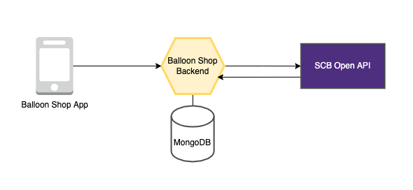

# SCB Open API Examples
This repository contains sample code to illustrate how to work with [SCB Open API](https://developer.scb/).
// You can just clone and run. 

---
## Introduction
SCB provide meny useful financial APIs to the individual or business partners. To be the guideline how to connect with them we make the example partner system. this contains the following components.
* [Balloon Shop App](https://github.com/SCB-TechX/scb-open-api-examples/tree/master/balloon_shop_app) - Frontend application using [Flutter](https://flutter.dev/).
* [Balloon Shop Backend](https://github.com/SCB-TechX/scb-open-api-examples/tree/master/balloon_shop_backend) - Backend service using [NodeJs](https://nodejs.org/) with [ExpressJs](http://expressjs.com/).

---
## Getting started
1. Run [Balloon Shop Backend](https://github.com/SCB-TechX/scb-open-api-examples/tree/master/balloon_shop_backend) as API server.
2. Configure [Balloon Shop App](https://github.com/SCB-TechX/scb-open-api-examples/tree/master/balloon_shop_app) to connect with backend server.
3. Run an application.

---
## Contributing
- [ ] Unit testing
- [ ] Documentation
- [ ] Get transaction detail
- [ ] Verify Slip
- [ ] Another use cases and API
